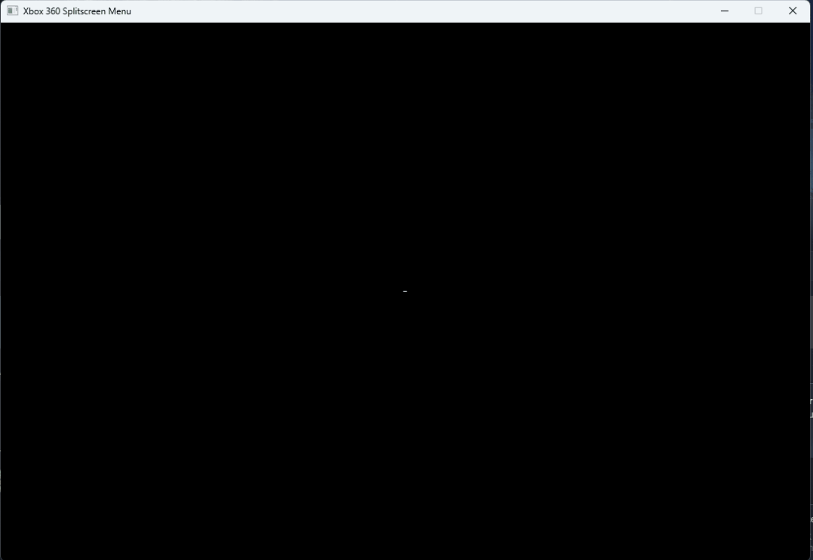

# MCC User Interface (Xbox 360 Guide)

## Why Did I Make This?
I felt as if the existing UI for the  was too clunky and needed a facelift.  So, I taught myself how to use SDL2 and its accompanying libraries and created a more elegant solution to the UI problem.

### Functionality
This executable is the first part of a major update to .  It aims to recreate the user interface used in the Xbox 360 console.  Functionality-wise, it allows the user to add/subtract players from the mod as well as change the controller designation, colors and team of each player individually in addition to toggling whether player 1 uses the keyboard and a mouse or the first controller.  Currently, this user interface supports keyboard interaction via the arrow keys and generic controller inputs.

### Planned Features
In order to future-proof this project, I am going to create a save system so that profiles will be autosaved to a JSON file read from the UI as opposed to the .  Other than that, I think the UI is essentially complete.  I am still working on an implementation plan for getting it into .  
